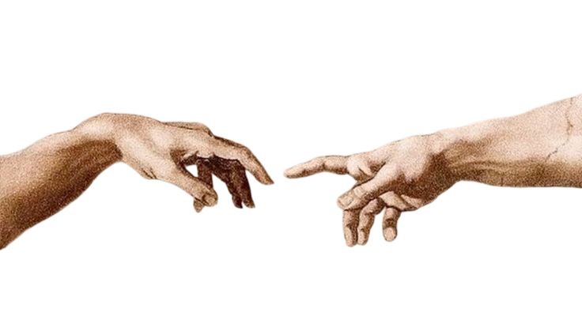

  

  
  &nbsp;&nbsp;<h1>Livicianaa</h1>&nbsp;&nbsp;
  
   
  Anonymous Developer 🐈‍⬛

  

👋 Hey, I'm Livicianaa — nice to meet you.

 

## 📖 About Me

  

- 🔭 Building small, weird, and occasionally useful things on the internet
- 🌱 Currently sharpening frontend engineering & creative coding
- 🎨 Half developer, half designer — code and visuals live in the same brain
- 💭 Clean code is a form of art, bugs are just improvisation
- 💬 Ask me about frontend dev, UI/design, or creative web stuff
- ⚡ Fun fact: debugging hits different at 3AM
- ✨ I only ship things I'd actually use myself

  
  
  
  

 

## 🖐️ Languages & Tools I've Placed My Hands On

  

 

## ⚡ GitHub Stats

  
  
   
  

 

## 🛠️ Tech Stack

 

<table>
<tr>
<td width="55%" valign="top">

### ⭐ Top Repos

| Repo | Stars |
|---|---|
| [DuoCode](https://github.com/Livicianaa/DuoCode) |  |
| [ArchLinux-Excalibur-Fan-RGB-control-panel](https://github.com/Livicianaa/ArchLinux-Excalibur-Fan-RGB-control-panel) |  |
| [Django-Web](https://github.com/Livicianaa/Django-Web) |  |

</td>
<td width="45%" valign="top">

### 🍁 Quote

> "Not everything needs a name to be real."

</td>
</tr>
</table>

 

## 🚀 Projects

| Project | What it does | Link |
|---|---|---|
| **Codemisk** | Web design & software agency — turning ideas into code, code into results. | [codemisk.com.tr](https://codemisk.com.tr) |
| **Shorty** | Link shortener with click analytics, visitor stats and a membership system. | [live demo](https://url-shortener-kappa-five.vercel.app/) |
| **3D Portfolio** | Interactive 3D developer portfolio built with Three.js. | [live demo](https://3-d-developer-portfolio-nine.vercel.app/) |
| **Excalibur Panel** | Fan speed & keyboard RGB control panel for Arch Linux (QML). | [GitHub](https://github.com/Livicianaa/ArchLinux-Excalibur-Fan-RGB-control-panel) |
| **FarlandsBot** | Landing page for a Discord bot. | [live demo](https://farlands-bot-git-main-livicinas-projects.vercel.app) |
| **ÇizBeni** 🔧 | Real-time multiplayer drawing & guessing game — in progress. | soon |

<i>"Some create with a name. I create with intent."</i>

