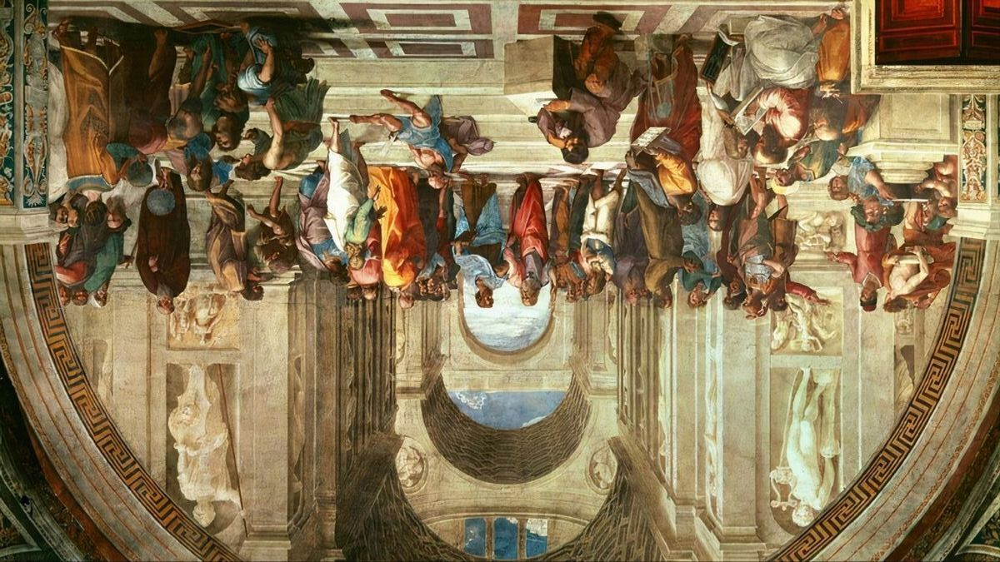
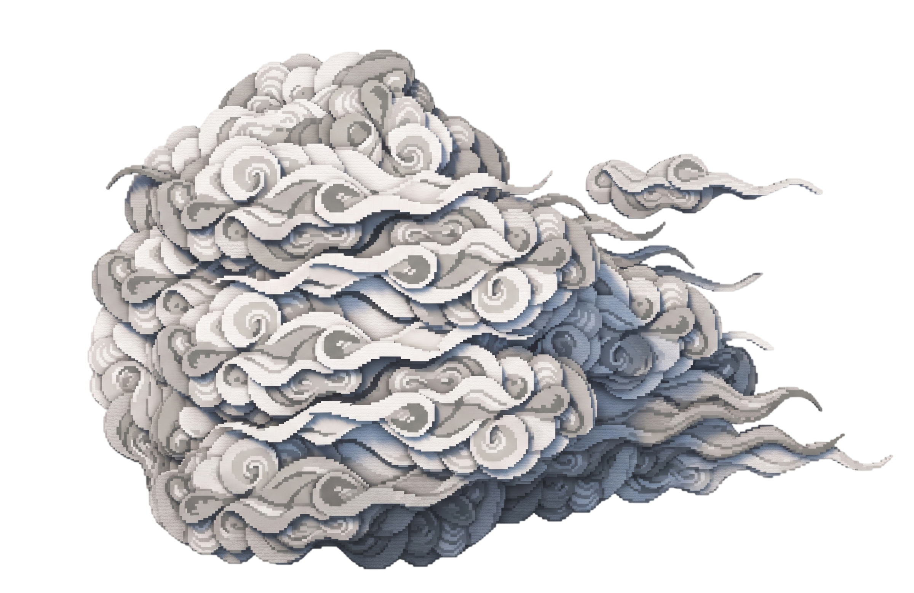
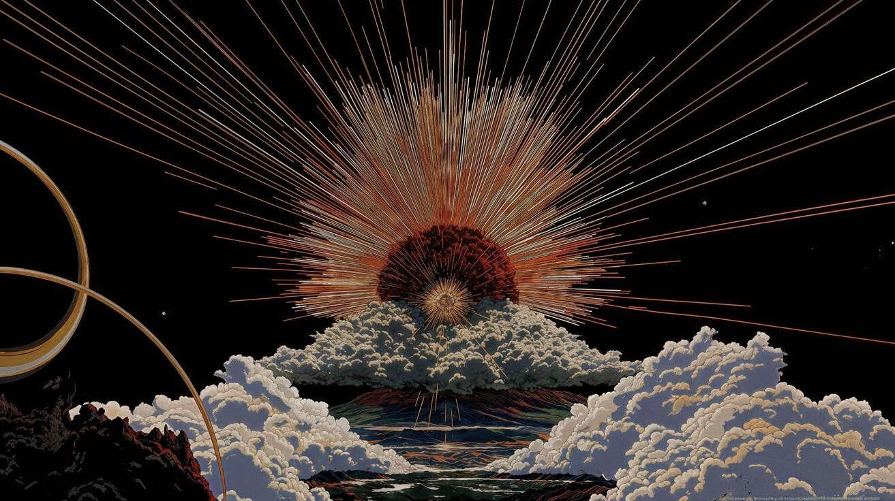

  

  

👋 I'm Livicianaa

 

## About Me

  

- Frontend developer focused on modern, interactive web experiences
- Founder of Codemisk — a web design & software studio
- Also into graphic design: logos, posters, illustration, mobile UI
- Comfortable across JavaScript, React, Node.js, Java, PHP, Python and the usual web stack
- Ask me about frontend dev, UI/UX, or creative front-end work
- I only ship things I'd actually use myself

<b>Follow Me on:</b>

  
  
  
  

 

## 🖐️ Languages & Tools I've Placed My Hands On

  

 

## ⚡ GitHub Stats

  
  
   
  

 

## 🛠️ Tech Stack

 

## ⭐ Recent Projects

<!--RECENT:start-->
<!-- updated 2026-10-07 -->

  
  
   
  
  

<!--RECENT:end-->

<i>🍁 "Not everything needs a name to be real."</i>

 

## ☕ Support Me

  

 

  

